# WebSiteTrading
descripción de proyecto 

sitio en donde se hablará sobre trading y se posteará información correspondiente al apasionante mundi de mercados financieros

características implementadas

en el proyecto se inicia a implementar el marqueteo de la pagina web por medio de htmlo en el index, donde se colocan cuatro secciones las cuales son las siguientes: 

    Inicio
    Mercado
    Educación
    Contacto

adicional a ello, se inician a trabajr con media queries para el responsive y se incluyen imágenes en la pagina web para la sección de Mercado y un videoen la sección de Educación  en donde se mostrará definiciones básicas de los diferentes mercados que se pueden encontrar a travez de su recorrido en el trading 
pasos seguidos 

1. Creación repositorio github
  
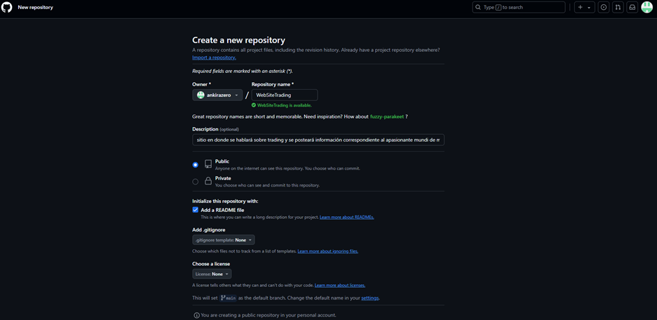
 
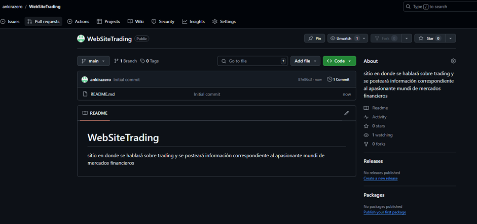

2. Subir código a repositorio 
 
 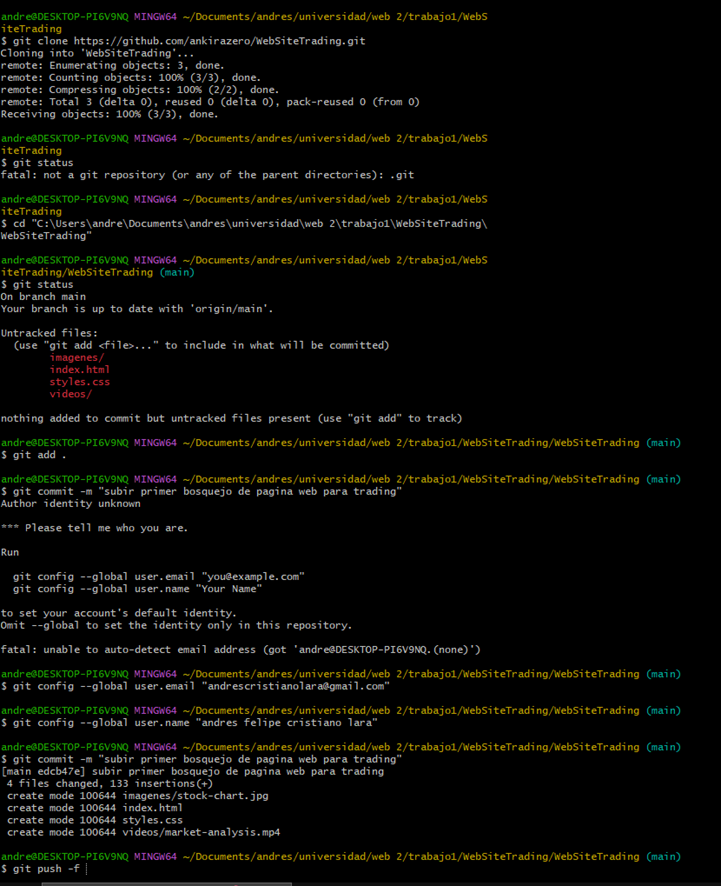

3. configurar github pages para probar funcionamiento

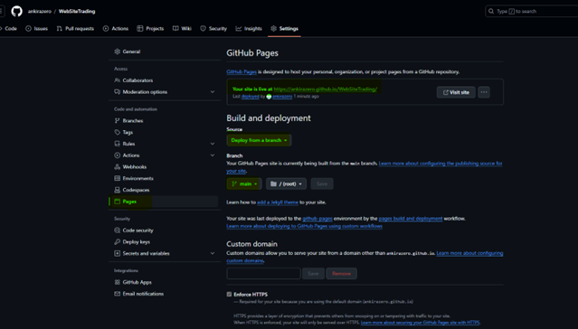

4. verificaciones en github pages y wave

    github pages

    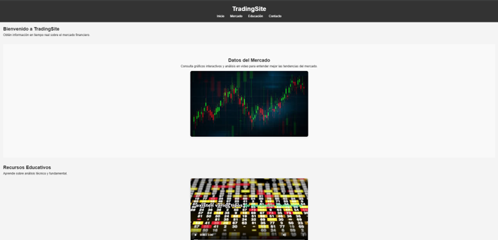

    wave

    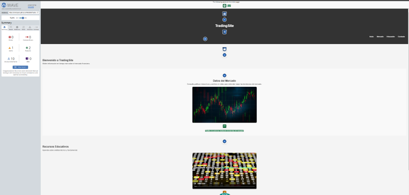

TRABAJO 2 

1. adicion nueva rama para cambios nodejs y express

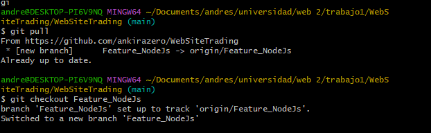

2. inicializar nodejs 

npm init -y

instalar express 

npm install express

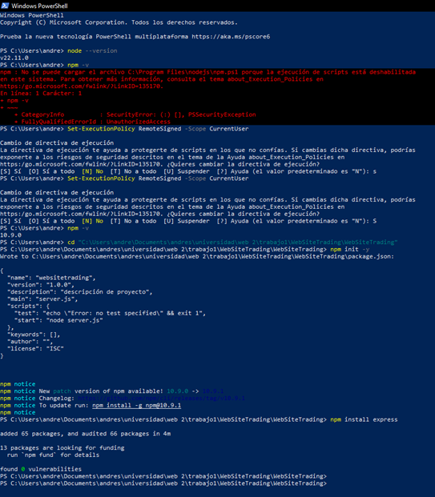

3. cambios para adicion de sevidor nodejs y express 

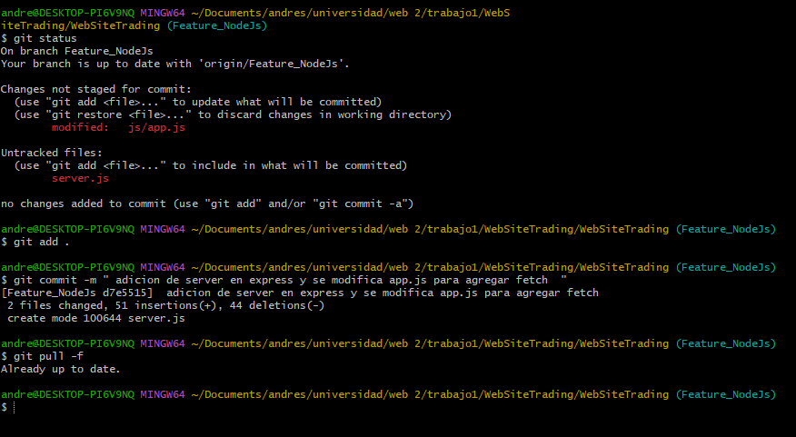
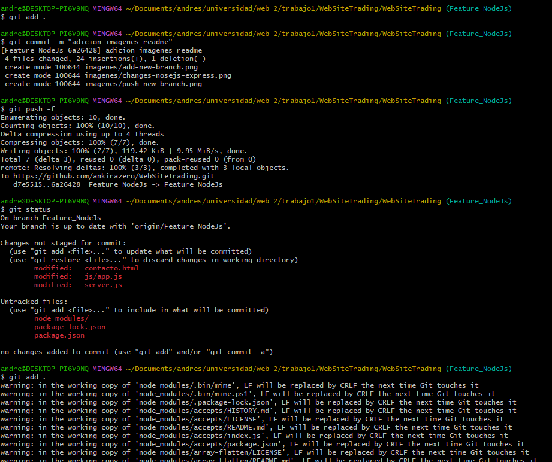

4. verificaciòn en la interfas de github de cambios subidos 

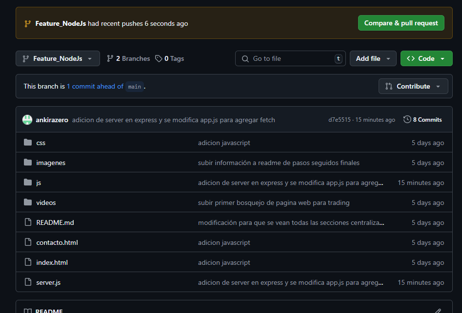

5. creacion pull request a main 

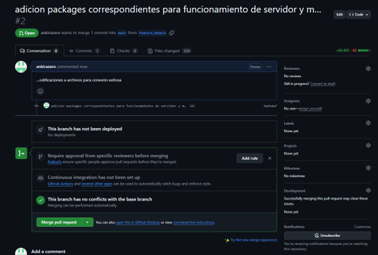

6. prueba conexiòn server 

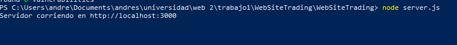

7. visualizaciòn formulario localhost

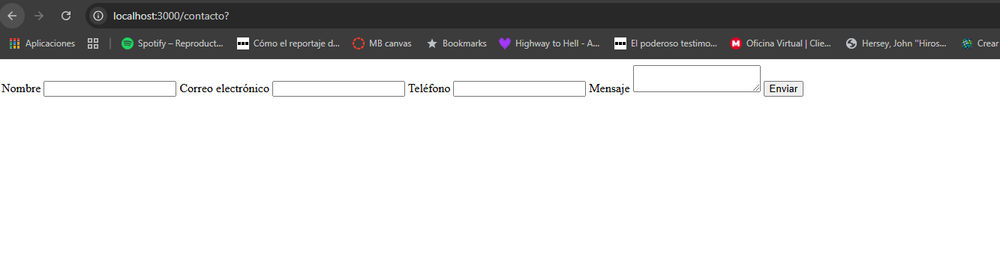

8. subida de nuevo codigo y actualizaciones de pagina

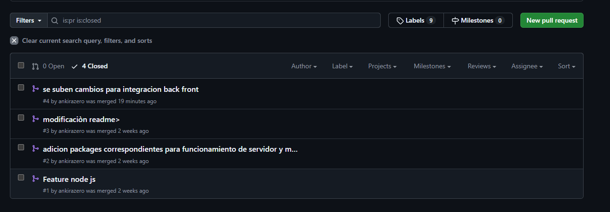

9. ir a vercel y configurar proyecto de github

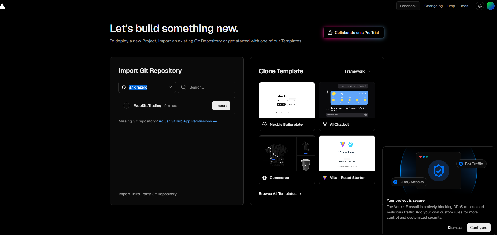

10. importar proyecto y deploy

11. despliegue completado y url de despliegue https://web-site-trading-v8pg.vercel.app/

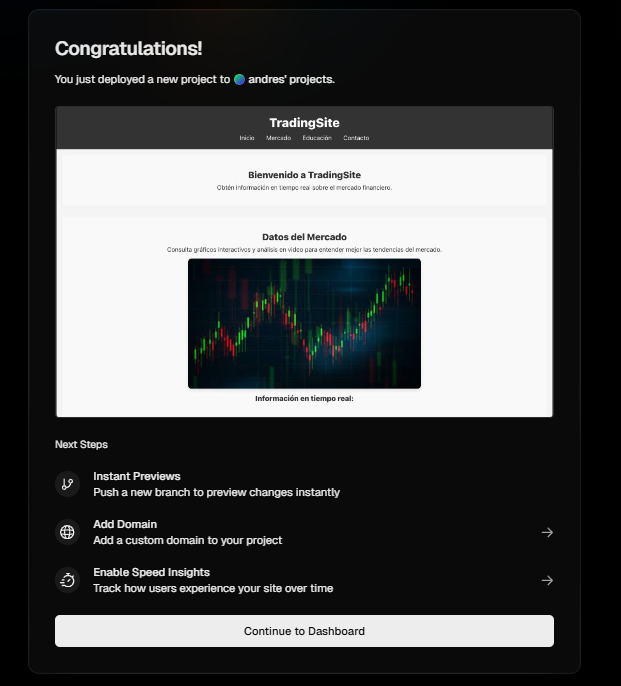
